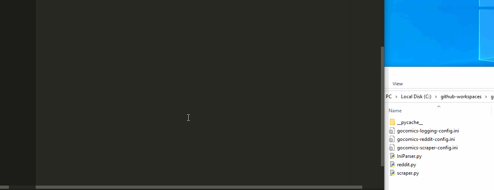

# go-comics-scraper
Scrape GoComic and post to Reddit

## Requirements

Install the requirements:

`pip install -r requirements.txt`

## Scraper

The scraper currently takes in a list of comics to scrape images from and then downloads them to disk.

